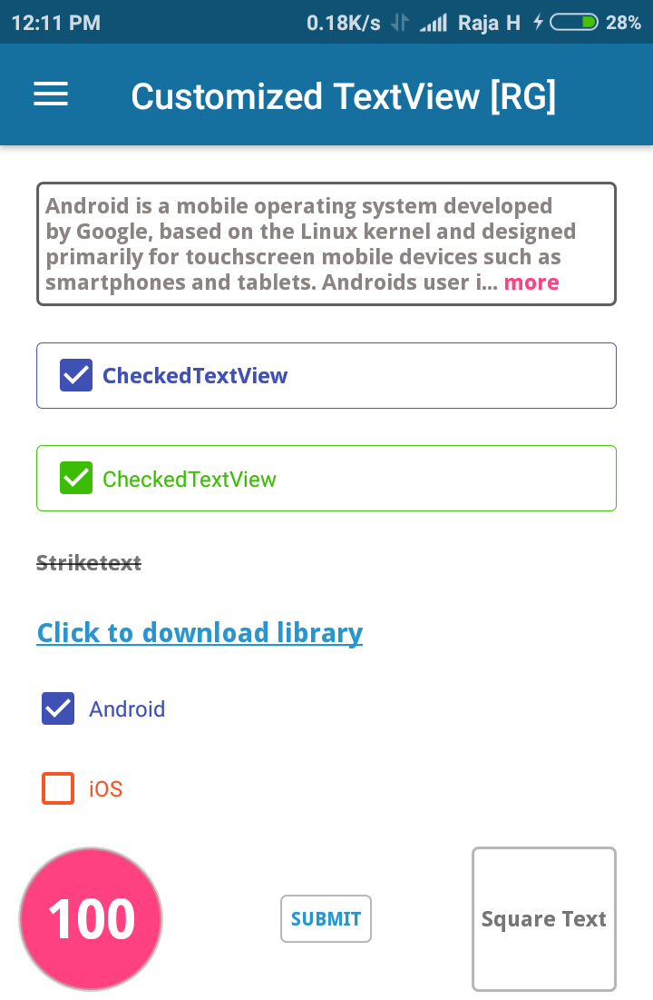

# Customized and Expandable TextView

Simple library to change the Textview as rectangle, circle and square shapes by adding one line of code in xml file.Multiple features are implemented and wrapped into single textview.

# Features  

1.Textview shape  -> rectangle, square and circle shapes   
2.Expandable textview  
3.Font change via xml   
4.UnderLine textview via xml    
5.Strike through text via xml    
6.CheckedTextView  
7.Disable checkedTextView  
8.Added ripple effect on click

the above features are done through xml file.

<a href="http://www.methodscount.com/?lib=com.libRG%3Acustomtextview%3A1.2"></a>    <a href="http://www.methodscount.com/?lib=com.libRG%3Acustomtextview%3A1.2"></a>

<a href='https://bintray.com/rajagopalr3/CustomizedTextView/CustomTextView/_latestVersion'></a>

<a href='https://bintray.com/rajagopalr3/CustomizedTextView/CustomTextView?source=watch' alt='Get automatic notifications about new "CustomTextView" versions'></a><a href='https://bintray.com/rajagopalr3/CustomizedTextView/CustomTextView?source=watch' alt='Get automatic notifications about new "CustomTextView" versions'></a>

 

# Implementation

# Using Gradle:

```

dependencies {
    implementation 'com.libRG:customtextview:2.1'
}

```

# Import as Module
Download the .aar file using below link and add this as module into your project

[Donwload module])https://github.com/Rajagopalr3/CustomizedTextView/blob/rajgopalr3/customtextview-2.1.aar

```
dependencies {
     implementation project(':customtextview')
}

Add this into settings.gradle file:
include ':customtextview'

```

# XML

```
 <com.libRG.CustomTextView
                android:id="@+id/c6"
                android:layout_width="wrap_content"
                android:layout_height="wrap_content"
                app:lib_setFont="@string/droidSansBold"
                app:lib_setRadius="3dp"
                android:text="rectagular textview"
                app:lib_setRoundedBorderColor="@color/colorPrimary"
                app:lib_setRoundedView="true"
                app:lib_setShape="rectangle"/>

                      
```


# Set Font
  Add your font files into assets folder. In string.xml files find your font files like below

```
    <string name="DroidSansBold">DroidSans-Bold.ttf</string>
    
```
# Change Logs [v1.6]

 1. Bug fixes - creating customtextview by programmatically
 2. Removed unused lines in library
 
# Change Logs [v1.3]

 1. Able to change the expanded and collapse hint  
 2. Bug fixes.

# Change Logs [v1.2]

New feature:

 1. Added strike through text  
 2. Added CheckedTextView with custom listener.
 3. We can set custom drawables, drawableTint color for checked & unchecked states

Bug Fixes:

 1. Fixed the click events in various views like event in underlineText view, rectangle text.
 2. Removed unused codes.


# Attributes

 |        Attributes          |            Description            |         Default Value         |
 | ------------------------   | -------------------------------   | --------------------------    |
 | lib_setRoundedView         | if true rounded view enabled      |  false in default             |
 | lib_setShape               | if roundedview true, set shape    |  rectangle in default         |
 | lib_setStrokeWidth         | set stroke width in dp            |  1 dp in default              |
 | lib_setRoundedBorderColor  | set stroke color                  |  current theme's accent color |
 | lib_setRadius              | set corner radius of rectangle    |  1 dp in default              |
 | lib_setRoundedBGColor      | set BG color of rectangle,circle  |  transparent color in default |
 | lib_setFont                | set font name in string           |  android's default font       |
 | lib_setExpandableText      | if true expandable text enabled   |  false in default             |
 | lib_setActionTextVisible   | set visibility if action text     |  false in default             |
 | lib_setActionTextColor     | set color of action text          |  current theme's accent color |
 | lib_setTrimLines           | set lines to trim in textview     |  0 in default                 |
 | lib_setUnderLineText       | set underline to text in textview |  false in default             |
 | lib_setStrikeText          | set strike through text in view   |  false in default             |
 | lib_setCheckedText         | set checked mode enable in view   |  false in default             |
 | lib_setChecked             | change state as checked|unchecked |  unchecked state in default   |
 | lib_checkedDrawable        | set checked drawable icon         |  default checked icon added   |
 | lib_unCheckedDrawable      | set unchecked drawable icon       |  default unchecked icon added |
 | lib_checkMarkTint          | set drawable color in textview    |  default color                |
 | lib_disableCheckedTextClick| set clickable true or false       |  bydefault false              | 
 | lib_checkedIconPosition    | set checkBox position             |  right side in default        |
 | lib_checkedDrawablePadding | set checkBox padding in view      |  5dp in default               |
 | lib_setExpandHint          | set readmore hint like "show more"|  "more" in default            |
 | lib_setCollapseHint        | set readless hint like "less"     |  "less" in default            |
 | lib_enable_ripple_effect   | enable ripple effect              |  false in default             |
 | lib_setRippleColor         | set ripple  color                 |  transparent color in default | 
 
 
  # License
 
 ```
 
Copyright 2017 Rajagopal

Licensed under the Apache License, Version 2.0 (the "License");
you may not use this file except in compliance with the License.
You may obtain a copy of the License at

   http://www.apache.org/licenses/LICENSE-2.0

Unless required by applicable law or agreed to in writing, software
distributed under the License is distributed on an "AS IS" BASIS,
WITHOUT WARRANTIES OR CONDITIONS OF ANY KIND, either express or implied.
See the License for the specific language governing permissions and
limitations under the License.
 
```  


