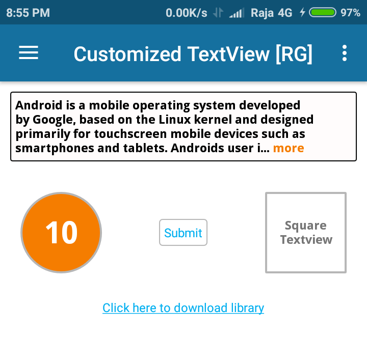

# Customized and Expandable TextView

Simple library to change the Textview as rectangle, oval and square shapes by adding one line of code in xml file.Also it has the feature of expandable text and adding fonts to the text. 



# Usage
To make a CustomTextView in your layout XML and add CustomTextView library in your project or you can also add it via Gradle.


Add it in your app build.gradle at the end of repositories if not present in gradle file:

```

# Gradle Depedencies :

dependencies {
    compile 'com.libRG:customtextview:1.0'
}

Note : use "implementation" instead of "compile" in dependencies section.
       "compile" is deprecated in android studio 3+ versions. 

# Import as Module

Download customtextview-1.0.aar file and import as module into your gradle file:


```

# XML

```
 <com.libRG.CustomTextView
                android:id="@+id/customTxt"
                android:layout_width="match_parent"
                android:layout_height="wrap_content"
                android:layout_gravity="center"
                android:layout_margin="5dp"
                android:gravity="center"
                android:padding="5dp"
                android:text="Your Text Here..."
                app:lib_setFont="@string/DroidSansBold"
                app:lib_setRadius="3dp"
                app:lib_setRoundedBorderColor="@color/grey"
                app:lib_setRoundedView="true"
                app:lib_setStrokeWidth="2dp"
                app:lib_setShape="rectangle" />
                      
```


# Set Font
  Add your font files into assets folder. In string.xml files find your font files like below

```
    <string name="DroidSansBold">DroidSans-Bold.ttf</string>
    
```


# Attributes

 |        Attributes          |            Description            |         Default Value         |
 | ------------------------   | -------------------------------   | --------------------------    |
 | lib_setRoundedView         | if true rounded view enabled      |  false in default             |
 | lib_setShape               | if roundedview true, set shape    |  rectagnle|oval               |
 | lib_setStrokeWidth         | set stroke width in dp            |  1 dp in default              |
 | lib_setRoundedBorderColor  | set stroke color                  |  current theme's accent color |
 | lib_setRadius              | set corner radius of rectanle     |  1 dp in default              |
 | lib_setRoundedBGColor      | set BG color of rectangle,circle  |  transparent color in deafult |
 | lib_setFont                | set font name in string           |  android's default font       |
 | lib_setExpandableText      | if true expandable text enabled   |  false in default             |
 | lib_setActionTextVisible   | set visibility if action text     |  false in default             |
 | lib_setActionTextColor     | set color of action text          |  current theme's accent color |
 | lib_setTrimMode            | set trim mode by line or length   |  trimModeLine|trimModeLength  |
 | lib_setTrimLines           | set lines to trim in textview     |  0 in default                 |
 | lib_setTrimLength          | if readmore true, set char length |  240 char in default          |


# License

```
Copyright 2017 Rajagopal

Licensed under the Apache License, Version 2.0 (the "License");
you may not use this file except in compliance with the License.
You may obtain a copy of the License at

   http://www.apache.org/licenses/LICENSE-2.0

Unless required by applicable law or agreed to in writing, software
distributed under the License is distributed on an "AS IS" BASIS,
WITHOUT WARRANTIES OR CONDITIONS OF ANY KIND, either express or implied.
See the License for the specific language governing permissions and
limitations under the License.

```
